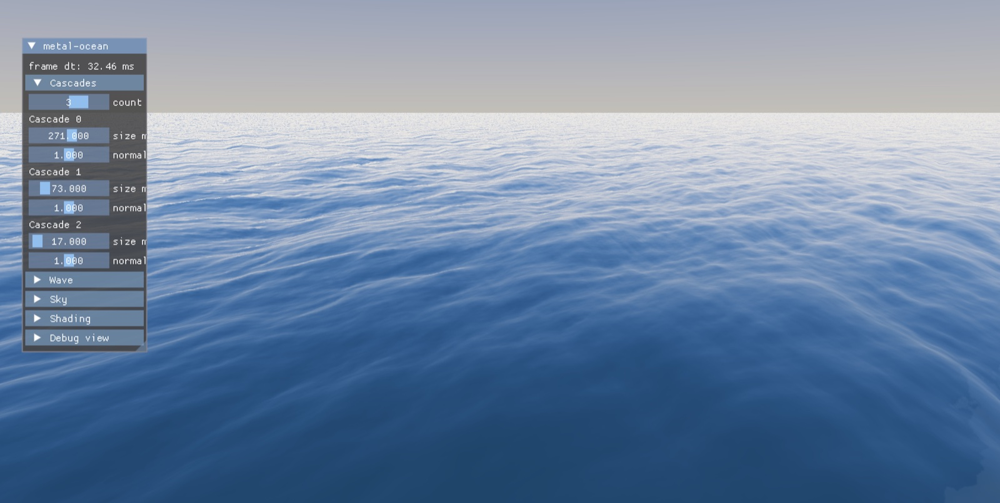

# metal-ocean


Real-time FFT ocean renderer for macOS. Metal + AppKit, C++20 / Objective-C++.



- Phillips spectrum with directional swell
- Three cascades (271 / 73 / 17 m patches at 256×256), Stockham radix-2 inverse FFT in compute
- Displacement, normal and Jacobian foam maps
- Projected-grid surface (Johanson 2004)
- Preetham sky baked to a cubemap
- Fresnel, sun specular, depth-fog refraction, backlit-crest subsurface scatter, ACES tonemap

## Building

macOS 13+ (Metal 3), Xcode, CMake 3.24+, Ninja. Dependencies (glm, toml++,
Dear ImGui, googletest) are fetched by CMake on first configure, which
therefore needs network access.

```sh
cmake -B build -G Ninja
cmake --build build
cmake --build build --target run   # builds and opens metal-ocean.app
```

## Running

Drag to orbit, scroll to zoom. Wave, sky and shading parameters are live
sliders in the ImGui panel.

Settings load from `default-config.toml`, baked into the bundle at build
time. Override with `--config <file>` or repeatable `--set`:

```sh
./build/metal-ocean.app/Contents/MacOS/metal-ocean \
    --config stormy.toml --set wave.wind_speed_mps=20 --set sky.turbidity=6
```

## Benchmarking

```sh
./build/metal-ocean.app/Contents/MacOS/metal-ocean --set bench.bench_mode=true
```

runs a deterministic camera orbit (60 warm-up + 600 measured frames) and
writes per-frame CPU/GPU timings to `bench-<timestamp>.csv` in the working
directory.

## Tests

The simulation core (spectrum, FFT reference, projected grid, camera,
config) is plain C++ with no Metal dependency:

```sh
ctest --test-dir build
```

## References

- Jerry Tessendorf, *Simulating Ocean Water*, SIGGRAPH course notes, 2001
- Claes Johanson, *Real-time Water Rendering: Introducing the Projected Grid Concept*, 2004
- A. J. Preetham, Peter Shirley, Brian Smits, *A Practical Analytic Model for Daylight*, SIGGRAPH 1999

MIT licensed.
